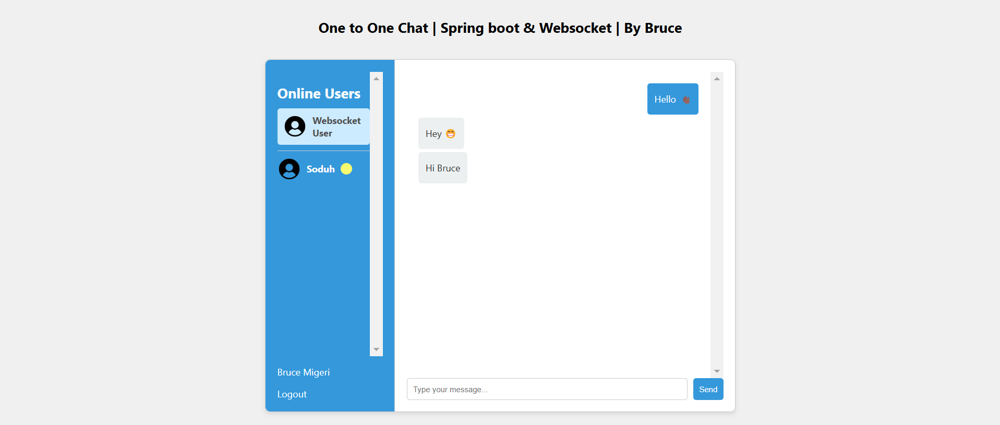

# websocket-chatroom-app

One On One Chat application | Spring boot & WebSocket

---

### Application demo



## Table of Contents

- [Features](#features)
- [Installation](#installation)
- [Technologies](#technologies)

## Features

- One to one chat application
- Secure communication
- Persistent chat


---


---

## Installation

Provide step-by-step instructions on how to install and set up your project locally.

```bash
# Clone the repository
git clone https://github.com/bruce-mig/websocket-chatroom-app.git

# Change into the project directory
cd your-project

# Build the project
./mvnw clean install

# Run project
./mvnw spring-boot:run
```

---
## Technologies

This project is mainly implement using the following technologies

- Websocket
- Spring Boot 3.x.x
- MongoDB
- Javascript
- HTML
- CSS
- Sockjs
- StompJs

---
